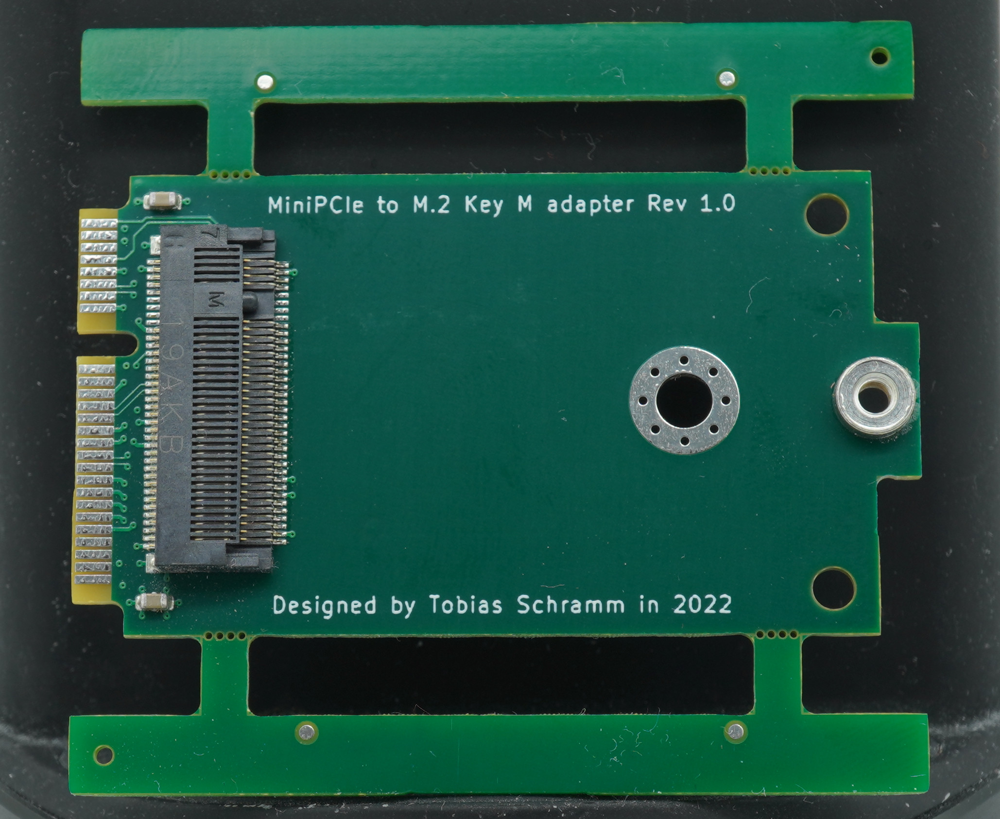
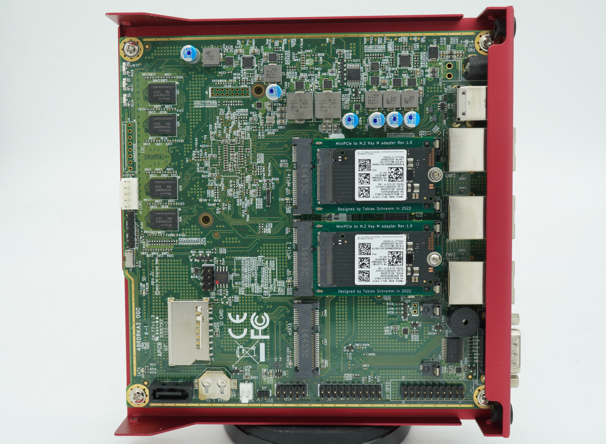

M.2 Key M to miniPCIe adapter
=============================

Especially slightly aged PCIe-enabled equipment intended for computer
networking applications often feature miniPCIe slots. Adding storage
capability to this type of device can be difficult. Even if one or more
of the mini PCIe slots are SATA-enabled availability of fitting mSATA SSDs
is continually becoming worse as mSATA SSDs have started to drift into
obscurity.  
This project is aimed at providing an option for fast, high reliability
NVMe-based storage in devices that do not have any M.2 Key M but only
miniPCIe slots.  
One example of such a device is the PCengines APU2, an AMD64 network
platform with up to two PCIe-enabled miniPCIe slots.

## Compatible SSDs

A bit of care has to be taken when selecting a SSD compatible with the
adapter. It only supports 2230 and 2242 M.2 PCIe SSDs. The more common
2280 size is not supported due to size constraints.  
Depending on the device the adapter is to be used in even 2242 M.2 SSDs
might not fit.  
I've had good sucess using Samsung PM991 NVMe SSDs.

# Ordering

The fabrication files inside `fab` are JLCPCB-ready. The board must be
ordered with a 1.2mm board thickness to fit the miniPCIe slot.  
Additionally I'd highly recommend selecting the "controlled impedance"
option with 7628 stackup. The PCIe interface has been routed with that
stackup in mind.

## Limitations

Currently this board does neither use gold plating nor edge beveling on
the miniPCIe contact fingers. While good for cost reduction in small
production runs this is not ideal.  
When ordering through JLCPCB at the time of writing the PCB would have
to be adjusted (minimum size 70x70mm) to be able to get beveled edges
and gold plating.

# Use

The following picture shows two of the adapters installed in an APU2
with Samsung PM991 NVMe SSDs.

